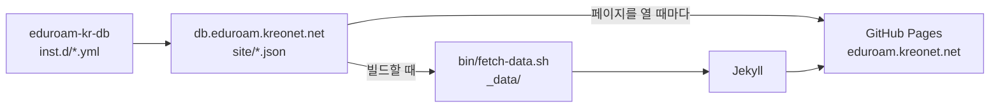

# eduroam Korea 안내 사이트

대한민국 eduroam 국가 로밍 운영기관(NRO) 안내 사이트입니다. <https://eduroam.kreonet.net>

## 기관 데이터

기관 데이터는 여기 없습니다. 정본은 [eduroam-kr-db](https://github.com/eduroam-kr/eduroam-kr-db) 이고, 화면은 브라우저가 `db.eduroam.kreonet.net` 에서 직접 받아 그립니다.



eduroam-kr-db 에 병합되면 몇 분 뒤 새로고침만으로 반영됩니다. 이 저장소를 다시 빌드하지 않아도 됩니다.

빌드할 때 `_data/` 로 받아 두는 값은 예비용입니다. JS 가 꺼져 있거나 크롤러가 볼 때, db 가 죽었을 때 이 값이 화면에 남습니다. 받은 쪽의 `built` 가 더 새로울 때만 덮어씁니다.

예비용 값까지 최신으로 맞추려면 Actions 에서 손으로 돌리거나, db 저장소에서 `repository_dispatch` 로 `db-updated` 를 보냅니다.

기관 정보를 고치려면 이 저장소가 아니라 **eduroam-kr-db 에 Pull Request** 를 보내세요.

## 페이지

| 경로 | 내용 |
|------|------|
| `/` | eduroam 소개, 국내 현황, 최근 공지 |
| `/connect/` | 접속 방법과 OS별 설정 |
| `/map/` | 지도와 참여기관 목록 |
| `/join/` | 기관 가입. 대학은 KREN, 연구기관은 NRO 담당 |
| `/notices/` | 공지 |
| `/policy/` | 이용 정책 |

영문은 `/en/` 아래 같은 구조입니다.

## 로컬에서 보기

```sh
bundle install
./bin/fetch-data.sh        # eduroam-kr-db 에서 기관 데이터 받기
bundle exec jekyll serve
```

## 공지 쓰기

`_notices/YYYY-MM-DD-이름.md` 를 만듭니다. 파일 하나에 국·영문 제목을 넣고 본문은 하나만 씁니다.

```yaml
---
title_ko: "서버 점검 안내"
title_en: "Scheduled maintenance"
date: 2026-10-01
---

본문은 한국어로 씁니다.
```

영문 목록에는 영문 제목이 나오고, 눌러 들어가면 같은 글로 연결됩니다. 공지는 운영 안내라 본문까지 번역하지 않습니다.

홈 화면의 공지 블록은 90일이 지나면 화면에서 사라집니다 (`_config.yml` 의 `notice_fresh_days`). 오래된 공지가 첫 화면에 남아 있으면 방치된 사이트로 보입니다. HTML 에는 그대로 있어 페이지 소스와 크롤러에서는 보이고, 상단 메뉴의 공지 링크도 그대로입니다.
